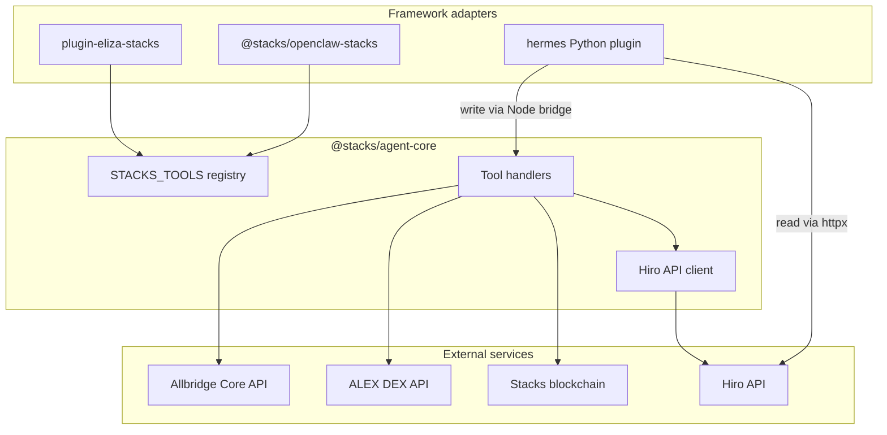

# Architecture

Stacks Plugins follows a **hub-and-spoke** model: one shared TypeScript library, three thin framework adapters.



## Repository layout

```
plugins/stacks/
├── agent-core/     @stacks/agent-core — shared TypeScript implementations
├── eliza/          ElizaOS plugin (actions)
├── openclaw/       OpenClaw plugin (registerTool + manifest)
├── hermes/         Hermes plugin (Python + Node write bridge)
├── .env.example    Environment variables for local dev
└── README.md
```

## `@stacks/agent-core`

The core package exports:

- **Tool handlers** — async functions such as `getBalance`, `sendTokens`, `stack`
- **`STACKS_TOOLS`** — canonical registry with `name`, `description`, `handler`, and `write` flag
- **Types** — TypeScript interfaces for every tool's params and results
- **Client helpers** — `apiUrl`, `stacksClient`, `resolveNetwork`

All blockchain I/O goes through [stacks.js](https://github.com/blockstack/stacks.js) and the Hiro REST API.

## Framework adapters

| Framework | Adapter pattern | Write tools |
| --- | --- | --- |
| **ElizaOS** | Wraps handlers in `Action` objects via `makeAction()` | `senderKey` in action params |
| **OpenClaw** | Registers tools with TypeBox schemas via `api.registerTool()` | Marked `optional: true` in manifest |
| **Hermes** | Python handlers + JSON schemas | Delegates to `stacks-write.mjs` subprocess |

### ElizaOS

`plugin-eliza-stacks` imports handlers directly from `@stacks/agent-core` and maps them to ElizaOS `Action`s with similes for intent matching. No duplicate business logic.

### OpenClaw

`@stacks/openclaw-stacks` uses `definePluginEntry` and registers each tool with a TypeBox parameter schema. Write tools are registered as **optional** so agents can run in read-only mode.

### Hermes

The Hermes plugin is Python-first for reads (direct `httpx` calls to Hiro, ALEX, and Allbridge). Write operations spawn a Node subprocess running `hermes/scripts/stacks-write.mjs`, which imports the same handlers from `@stacks/agent-core`.

```
Hermes (Python)  →  bridge.py  →  stacks-write.mjs  →  @stacks/agent-core
```

This keeps signing logic in one place while letting Hermes agents stay in Python for orchestration.

## Tool contract

Every framework exposes the **same 19 tool names** (e.g. `stacks_get_balance`, `stacks_send_tokens`). Parameters and return shapes match `@stacks/agent-core` types so agents can be ported between frameworks without retraining on different schemas.

See the [tool overview](/tools/overview) for the full list.

## Data flow: read vs write

**Read tools** (e.g. balance, history, read-only contract calls):

1. Agent invokes tool with address/contract params
2. Handler calls Hiro REST API (or ALEX/Allbridge for quotes)
3. JSON result returned to the agent

**Write tools** (e.g. send STX, stack, contract call):

1. Agent invokes tool with `senderKey` (+ transaction params)
2. Handler builds a transaction with `@stacks/transactions`
3. Transaction is signed and broadcast to the network
4. `{ txid, success }` returned to the agent

<Note>
  Amounts are always in **microSTX** (1 STX = 1,000,000 microSTX) unless noted otherwise for fungible tokens.
</Note>
