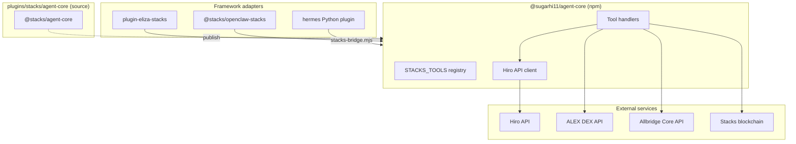

# Architecture

Stacks Plugins follows a **hub-and-spoke** model: one shared TypeScript library, three thin framework adapters.



## Repository layout

```
stacks-plugins/
├── docs/                       Mintlify documentation (this site)
├── plugins/stacks/
│   ├── agent-core/             @stacks/agent-core — shared TypeScript implementations
│   ├── eliza/                  ElizaOS plugin (actions + wallet provider)
│   ├── openclaw/               OpenClaw plugin (registerTool + manifest)
│   ├── hermes/                 Hermes plugin (Python + Node bridge)
│   │   ├── scripts/
│   │   │   ├── stacks-bridge.mjs   All-tool dispatcher
│   │   │   └── stacks-write.mjs    Legacy write-only bridge
│   │   └── skills/
│   │       └── stacks-onchain/     Bundled agent skill
│   ├── .env.example
│   └── README.md
└── README.md
```

## Agent core

The core package (`plugins/stacks/agent-core`, npm name `@stacks/agent-core`, published as **`@sugarhi11/agent-core`**) exports:

- **Tool handlers** — async functions such as `getBalance`, `sendTokens`, `stack`
- **`STACKS_TOOLS`** — canonical registry with `name`, `description`, `handler`, and `write` flag
- **Types** — TypeScript interfaces for every tool's params and results
- **Client helpers** — `apiUrl`, `stacksClient`, `resolveNetwork`

All blockchain I/O goes through [stacks.js](https://github.com/blockstack/stacks.js) and the Hiro REST API.

## Framework adapters

| Framework | Adapter pattern | Tool count | Write tools |
| --- | --- | --- | --- |
| **ElizaOS** | Wraps handlers in `Action` objects via `makeAction()`; `STACKS_WALLET` provider | 33 | `senderKey` or `STACKS_SENDER_KEY` |
| **OpenClaw** | Registers tools with TypeBox schemas via `defineToolPlugin()` | 34 (+ `stacks_wallet_info`) | Marked `optional: true` in manifest |
| **Hermes** | Python handlers + Node subprocess bridge | 33 | `STACKS_SENDER_KEY` injected by bridge |

### ElizaOS

`plugin-eliza-stacks` imports handlers from `@sugarhi11/agent-core` and maps them to ElizaOS `Action`s with similes for intent matching. The **`STACKS_WALLET`** provider injects network, wallet address, and signing status into agent context.

### OpenClaw

`@stacks/openclaw-stacks` uses `defineToolPlugin` and registers each core tool with a TypeBox parameter schema. It also exposes **`stacks_wallet_info`** for wallet/network status. Write tools are registered as **optional** so agents can run in read-only mode.

### Hermes

All Hermes tool handlers are thin Python wrappers that delegate to **`scripts/stacks-bridge.mjs`**, which loads `@sugarhi11/agent-core` and dispatches to the matching handler in `STACKS_TOOLS`.

```
Hermes (Python)  →  bridge.py  →  stacks-bridge.mjs  →  @sugarhi11/agent-core
```

The plugin also registers:

- **`/stacks`** slash command — wallet and signing status
- **`pre_llm_call`** hook — injects wallet context on the first turn
- **`post_tool_call`** hook — logs Stacks tool usage
- **Bundled skill** — `skills/stacks-onchain/SKILL.md`

## Tool contract

Every framework exposes the **same 33 core tool names** (e.g. `stacks_get_balance`, `stacks_send_sbtc`, `stacks_zest_supply_sbtc`). OpenClaw adds `stacks_wallet_info`. Parameters and return shapes match agent-core types so agents can be ported between frameworks without retraining on different schemas.

See the [tool overview](/tools/overview) for the full list.

## Data flow: read vs write

**Read tools** (e.g. balance, history, read-only contract calls):

1. Agent invokes tool with address/contract params
2. Handler calls Hiro REST API (or ALEX/Allbridge for quotes)
3. JSON result returned to the agent

**Write tools** (e.g. send STX, stack, contract call):

1. Agent invokes tool with `senderKey` (+ transaction params)
2. Handler builds a transaction with `@stacks/transactions`
3. Transaction is signed and broadcast to the network
4. `{ txid, success }` returned to the agent

<Note>
  Amounts are always in **microSTX** (1 STX = 1,000,000 microSTX) unless noted otherwise for fungible tokens. Eliza and Hermes adapters can parse human-readable STX amounts (e.g. `"1 STX"`) into microSTX.
</Note>
